# База данных — ERD

> Схема актуальна на апрель 2026. Сгенерирована из `taipan_db` (PostgreSQL 15).

---

## Группировка таблиц

| Группа | Таблицы |
|--------|---------|
| 👤 Пользователи | `users`, `athletes` |
| 🏆 Соревнования | `competitions`, `competition_results`, `competition_files` |
| 🥋 Аттестация | `certifications`, `certification_results` |
| 🏕️ Сборы | `camps`, `camp_participants` |
| 📋 Посещаемость | `training_sessions`, `attendance` |
| ⭐ Достижения | `athlete_achievements` |
| 🔔 Уведомления | `notifications`, `events`, `event_reminders` |
| 💰 Оплаты | `payments`, `monthly_fees`, `fee_deadlines` |
| 📰 Контент | `news`, `hall_of_fame` |
| 📅 Расписание | `schedule`, `sections` |
| 📊 Аналитика | `analytics`, `analytics_reports`, `analytics_requests` |
| 📲 Подписки | `telegram_subscribers`, `push_subscribers` |

---

## Диаграмма

```mermaid
erDiagram

  %% ── ПОЛЬЗОВАТЕЛИ ──────────────────────────────────────────────────────────

  users {
    int id PK
    varchar full_name
    varchar phone UK
    varchar email UK
    varchar password
    varchar role
    boolean is_active
    text strategy_items
    timestamp created_at
  }

  athletes {
    int id PK
    int user_id FK
    varchar full_name
    date birth_date
    varchar gender
    int gup
    int dan
    numeric weight
    varchar group
    boolean is_archived
    timestamp archived_at
    date insurance_expiry
    timestamp created_at
    timestamp updated_at
  }

  %% ── ЗАЯВКИ И ОПЛАТЫ ───────────────────────────────────────────────────────

  sections {
    int id PK
    varchar name
    text description
    numeric price
  }

  applications {
    int id PK
    int user_id FK
    int section_id FK
    varchar full_name
    varchar phone
    int age
    text comment
    varchar status
    timestamp created_at
    timestamp updated_at
  }

  payments {
    int id PK
    int user_id FK
    numeric amount
    varchar description
    varchar status
    timestamp created_at
    timestamp paid_at
  }

  fee_deadlines {
    int id PK
    date period
    date deadline
    numeric amount_due
    int created_by FK
    timestamp created_at
  }

  monthly_fees {
    int id PK
    int athlete_id FK
    int deadline_id FK
    int recorded_by FK
    date period
    numeric amount_due
    numeric amount_paid
    timestamp paid_at
    text note
  }

  %% ── ПОСЕЩАЕМОСТЬ ──────────────────────────────────────────────────────────

  training_sessions {
    int id PK
    date date
    varchar group_name
    text notes
    timestamp created_at
  }

  attendance {
    int id PK
    int session_id FK
    int athlete_id FK
    boolean present
  }

  %% ── СОРЕВНОВАНИЯ ──────────────────────────────────────────────────────────

  competitions {
    int id PK
    varchar name
    date date
    varchar location
    varchar level
    varchar comp_type
    float significance
    text notes
    int season
    int created_by FK
    timestamp created_at
    timestamp updated_at
  }

  competition_results {
    int id PK
    int competition_id FK
    int athlete_id FK
    int sparring_place
    int sparring_fights
    int stopball_place
    int stopball_fights
    int tegtim_place
    int tegtim_fights
    int tuli_place
    int tuli_perfs
    float rating
    varchar status
    boolean paid
    timestamp created_at
    timestamp updated_at
  }

  competition_files {
    int id PK
    int competition_id FK
    int uploaded_by FK
    varchar filename
    varchar stored_name
    varchar file_url
    timestamp uploaded_at
  }

  %% ── АТТЕСТАЦИЯ ────────────────────────────────────────────────────────────

  certifications {
    int id PK
    varchar name
    date date
    varchar location
    text notes
    varchar status
    boolean notify_sent
    int created_by FK
    timestamp created_at
    timestamp updated_at
  }

  certification_results {
    int id PK
    int certification_id FK
    int athlete_id FK
    int current_gup
    int current_dan
    int target_gup
    int target_dan
    boolean passed
    boolean paid
    timestamp created_at
    timestamp updated_at
  }

  %% ── СБОРЫ ─────────────────────────────────────────────────────────────────

  camps {
    int id PK
    varchar name
    date date_start
    date date_end
    varchar location
    numeric price
    text notes
    boolean notify_sent
    int created_by FK
    timestamp created_at
  }

  camp_participants {
    int id PK
    int camp_id FK
    int athlete_id FK
    varchar status
    boolean paid
    timestamp created_at
    timestamp updated_at
  }

  %% ── ДОСТИЖЕНИЯ ────────────────────────────────────────────────────────────

  athlete_achievements {
    int id PK
    int athlete_id FK
    varchar code
    boolean seen
    int season
    timestamp granted_at
  }

  %% ── УВЕДОМЛЕНИЯ И СОБЫТИЯ ─────────────────────────────────────────────────

  notifications {
    int id PK
    int user_id FK
    varchar type
    varchar title
    text body
    boolean is_read
    varchar link_type
    int link_id
    varchar response
    timestamp created_at
  }

  events {
    int id PK
    varchar title
    text description
    timestamp event_date
    varchar location
    int section_id FK
    int created_by FK
    boolean is_active
    json notify_before_days
    boolean notify_everyone
    timestamp created_at
    timestamp updated_at
  }

  event_reminders {
    int id PK
    int event_id FK
    int days_before
    int sent_count
    timestamp sent_at
  }

  %% ── КОНТЕНТ ───────────────────────────────────────────────────────────────

  hall_of_fame {
    int id PK
    varchar full_name
    varchar photo_url
    text achievements
    int gup
    int dan
    boolean is_featured
    int sort_order
    timestamp created_at
  }

  news {
    int id PK
    varchar title
    text body
    varchar photo_url
    boolean is_published
    int created_by FK
    int competition_id FK
    int certification_id FK
    int camp_id FK
    timestamp published_at
  }

  %% ── РАСПИСАНИЕ ────────────────────────────────────────────────────────────

  schedule {
    int id PK
    int section_id FK
    int day_of_week
    varchar time_start
    varchar time_end
    varchar trainer
    varchar location
  }

  %% ── ПОДПИСКИ ──────────────────────────────────────────────────────────────

  telegram_subscribers {
    int id PK
    varchar telegram_id UK
    int user_id FK
    varchar username
    varchar full_name
    boolean subscribed
    timestamp created_at
  }

  push_subscribers {
    int id PK
    int user_id FK
    text subscription
    boolean is_active
    timestamp created_at
  }

  %% ── АНАЛИТИКА ─────────────────────────────────────────────────────────────

  analytics {
    int id PK
    int athlete_id FK
    int created_by FK
    varchar title
    text comment
    varchar file_path
    varchar file_name
    timestamp created_at
  }

  analytics_reports {
    int id PK
    int athlete_id FK
    int created_by FK
    varchar title
    text content
    varchar status
    varchar file_url
    timestamp created_at
    timestamp updated_at
  }

  analytics_requests {
    int id PK
    int athlete_id FK
    int created_by FK
    text comment
    varchar status
    boolean paid
    timestamp created_at
    timestamp updated_at
  }

  %% ── СВЯЗИ ─────────────────────────────────────────────────────────────────

  users ||--o{ athletes : "родитель/спортсмен"
  users ||--o{ applications : "подаёт"
  users ||--o{ payments : "оплачивает"
  users ||--o{ notifications : "получает"
  users ||--o{ telegram_subscribers : "подписан"
  users ||--o{ push_subscribers : "подписан"

  sections ||--o{ applications : "для секции"
  sections ||--o{ events : "привязано"
  sections ||--o{ schedule : "расписание"

  athletes ||--o{ attendance : "посещаемость"
  athletes ||--o{ competition_results : "результаты"
  athletes ||--o{ certification_results : "аттестация"
  athletes ||--o{ camp_participants : "участие"
  athletes ||--o{ athlete_achievements : "ачивки"
  athletes ||--o{ monthly_fees : "взносы"
  athletes ||--o{ analytics : "аналитика"
  athletes ||--o{ analytics_reports : "отчёты"
  athletes ||--o{ analytics_requests : "запросы"

  training_sessions ||--o{ attendance : "содержит"

  competitions ||--o{ competition_results : "результаты"
  competitions ||--o{ competition_files : "файлы"
  competitions ||--o{ news : "новость"

  certifications ||--o{ certification_results : "результаты"
  certifications ||--o{ news : "новость"

  camps ||--o{ camp_participants : "участники"
  camps ||--o{ news : "новость"

  events ||--o{ event_reminders : "напоминания"

  fee_deadlines ||--o{ monthly_fees : "дедлайн"
```

---

## Примечания

### Таблицы в БД без Python-моделей

Следующие таблицы существуют в БД, но **не имеют соответствующих SQLAlchemy-моделей** в коде.
Это задел на будущее или результат старых миграций:

| Таблица | Назначение |
|---------|-----------|
| `analytics` | Файлы аналитики по спортсмену |
| `analytics_reports` | Отчёты (AI или ручные) |
| `analytics_requests` | Запросы на создание отчётов |
| `monthly_fees` | Учёт ежемесячных взносов |
| `fee_deadlines` | Дедлайны оплаты |
| `news` | Новости клуба |
| `competition_files` | Файлы к соревнованиям |

### Нестандартные поля

| Поле | Таблица | Комментарий |
|------|---------|-------------|
| `strategy_items` | `users` | `text` прямо в users — вероятно временный хак |
| `insurance_expiry` | `athletes` | Страховка спортсмена — не используется в коде |
| `age` | `users` | Дублирует вычисляемое поле из `athletes.birth_date` |
